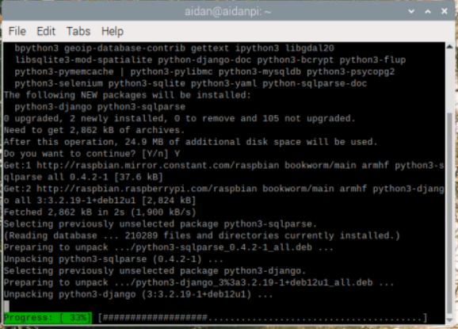
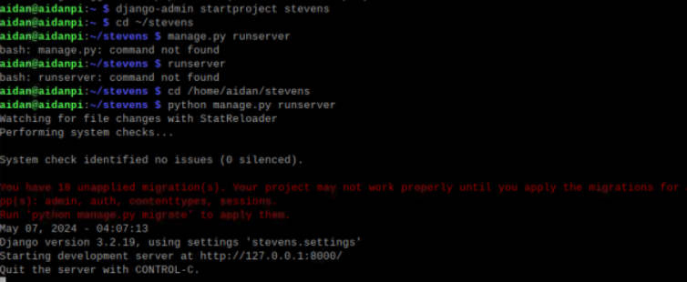

# Lab 4

## Objective
- Study the GitHub repository Lesson 4 labs
- Install Django and Django REST framework
- Use the default database, i.e., SQLite
- Start Django project "stevens," run server, and view app
- Start Django REST project "mycpu," run server, and view app
- Install Flask if no module named 'flask'
- Run Flask server via hello_world.py and view app

##Execution

